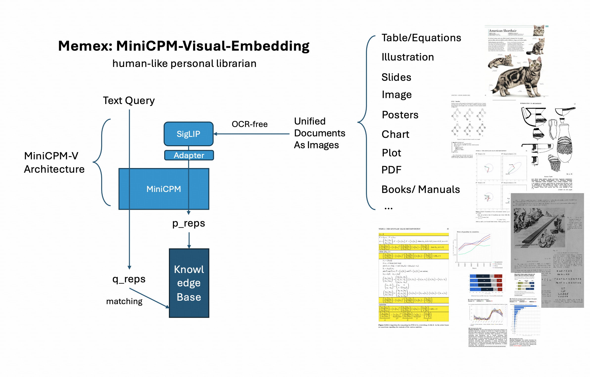

# MiniCPM Visual Embedding V0 Training Code

Training code for [MiniCPM-Visual-Embedding-V0](https://huggingface.co/RhapsodyAI/minicpm-visual-embedding-v0). 

This is a **full-parameter** and **arbitrarily large batch size contrastive learning** training and evaluation codebase to convert visual-language models (**VLMs**) into cross-modality (Text-to-Any) **dense retrieval** models. 

Based on MiniCPM-V series, which have strong OCR capability and high-resolution slicing technology, the trained dense retrieval model is able to retrieve any document as images.



## Usage 

### Model Preparation

Preprare MiniCPM-V-2.0 model checkpoint from huggingface.

### Data Conversion and Generation

> If you would like to acquire the training pairs directly, please open an issue with your email address. We will respond with data link soon.

Our training data is in the form of text query -> document image pairs. Our training data comes from two main sources: academic VQA datasets and model generated queries. 

> We use `hdf5` format to store image documents, because image documents are so large, which makes jsonl not suitable to use when we prepare trainign data. `hdf5` format enables a process to fastly and randomly read a document provided its identity, a `str`.

#### Academic Dataset Filtering

We utilized the following academic datasets to build query-document pairs: `ArxivQA`, `ChartQA`, `DocVQA`, `InforgraphicsQA`, `PlotQA`, and `SlideVQA`. These datasets, has a mapping `(question, answer, image document)`. We filter the dataset to find ones suitable for contrastive learning, because there are considerable number of `local` questions like `What's the name of the sender?` are not suitable for contrastive learning. We use few-shot prompting to filter useful questions using `query_classification/query_cls_vllm.py`.

#### Query Generation with Instruction-tuned VLM

Besides using academic datasets, we also use instruction-tuned VLMs to generate queries for a large number of unlabled visually-intensive documents. We utilized `ICML papers`, `NIPS papers`, `Manuallib`, `e-books` and other `collected PDFs` to generate queries. 

To render a large number of PDFs into images, we build a toolkit.

1. Split PDFs into pages and store in a jsonl file.

2. Render with multiple CPUs (fast).

After rendering the PDFs, generate queries for all documents using instruction-tuned Vision Language Models. 

To generate queries using `MiniCPM-V-2.0`, consider using `query_generation/inference_minicpmv.sh` for multi-GPU and batch inference.


### Build Train and Test Dataset

> This series of code is also based on `hdf5` format. 

After preparing all documents and corresponding queries, use `generate_train_test`.


### Configure environment

Use the following code to install dependencies for `MiniCPM-V-2.0` and training scripts.
```
bash configure_environment.sh
```

### Train

For single-node and single-GPU debug, please consider using the following bash script.

```
bash train_mm_dev.sh
```

Our framework has enabled us to train large VLMs with deepspeed zero stage 1, which supports up to `13B` VLMs full-parameters training of dense retrieval. To enbale `deepspeed`, pass `--deepspeed` to the training script.

Our framework also supports self-implemented `GradCache`, which is compatible with `DeepSpeed` here, and also gradient checkpointing for longer sequences. 

To enable large batch size (like 4096) for contrastive learning, use `--grad_cache_enable true` and `--grad_cache_micro_batch_size 2`. The training of VLM based dense retriever requires a significant large GPU memory, because slicing mechanism often makes batch size for ViT 6~9 times of LLM batch size. To use `GradCache` is useful when you turn VLMs into dense retrievers.

Our framework is based on huggingface Trainer, so it supports multiple features from huggingface Trainer.


### Eval

Our evaluation supports multi-node and multi-GPU inference, and does not require `faiss-gpu`. We implemented native pytorch retrieval process. Such improvements enabled it to evaluate a dense retrieval model on a large dataset quickly.

For debug, please consider the following bash script.

```
bash eval_mm_dev.sh
```


### Issues

The codebase is a cleaned version, and some components may be missing, if so, please feel free to open an issue in this repo. 


### Acknowledgement

We are a part of [OpenBMB](https://github.com/OpenBMB). The developers of this project have also participated in the development of [MiniCPM-V](https://github.com/OpenBMB/MiniCPM-V) series.


### Citation

If you find our work useful, please consider cite us:

```bibtex
@misc{RhapsodyEmbedding2024,
  author = {Rhapsody Group},
  title = {Memex: OCR-free Visual Document Embedding Model as Your Personal Librarian},
  year = {2024},
  howpublished = {\url{https://huggingface.co/RhapsodyAI/minicpm-visual-embedding-v0}},
  note = {Accessed: 2024-06-28}
}
```

